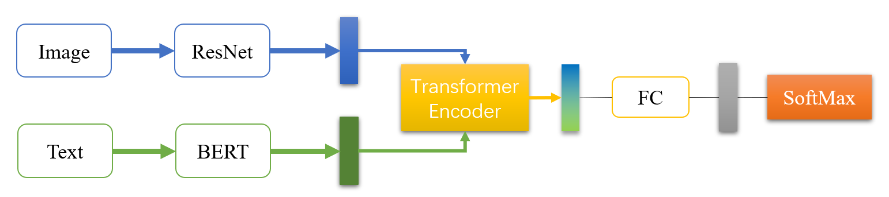

# Multimodal-Sentiment-Analysis
多模态情感分析——基于BERT+ResNet50的多种融合方法，数据学院人工智能课程第五次实验代码

本项目基于Hugging Face和torchvision实现，共有五种融合方法（2Naive 3Attention），在Models文件夹中查看

## Project Structure

```
|-- Multimodal-Sentiment-Analysis
    |-- Config.py
    |-- main.py
    |-- README.md
    |-- requirements.txt
    |-- Trainer.py
    |-- data
    |   |-- .DS_Store
    |   |-- test.json
    |   |-- test_without_label.txt
    |   |-- train.json
    |   |-- train.txt
    |   |-- data
    |-- Models
    |   |-- OTEModel.py
    |   |-- __init__.py
    |-- utils
        |-- common.py
        |-- DataProcess.py
        |-- __init__.py
        |-- APIs
        |   |-- APIDataset.py
        |   |-- APIDecode.py
        |   |-- APIEncode.py
        |   |-- APIMetric.py
        |   |-- __init__.py
    |-- MVSA-multiple
        |-- MVSA
            |-- labelResultAll
    |-- MVSA-Single
        |-- MVSA
            |-- labelResultAll
```
## Requirements

**chardet==4.0.0
numpy==1.22.2
Pillow==9.2.0
scikit_learn==1.1.1
torch==1.8.2
torchvision==0.9.2
tqdm==4.63.0
transformers==4.18.0**

```shell
pip install -r requirements.txt
```

## Model

**OutputTransformerEncoder**




## Result

| Model                         | Acc        |
| ----------------------------- | ---------- |
| **OutputTransformerEncoder**  | **74.625** |


OutputTransformerEncoderModel Result：

| Feature    | Acc    |
| ---------- | ------ |
| Text Only  | 71.875 |
| Image Only | 63     |

## Reference

Joint Fine-Tuning for Multimodal Sentiment Analysis：[guitld/Transfer-Learning-with-Joint-Fine-Tuning-for-Multimodal-Sentiment-Analysis: This is the code for the Paper "Guilherme L. Toledo, Ricardo M. Marcacini: Transfer Learning with Joint Fine-Tuning for Multimodal Sentiment Analysis (LXAI Research Workshop at ICML 2022)". (github.com)](https://github.com/guitld/Transfer-Learning-with-Joint-Fine-Tuning-for-Multimodal-Sentiment-Analysis)

Is cross-attention preferable to self-attention for multi-modal emotion recognition：[smartcameras/SelfCrossAttn: PyTorch implementation of the models described in the IEEE ICASSP 2022 paper "Is cross-attention preferable to self-attention for multi-modal emotion recognition?" (github.com)](https://github.com/smartcameras/SelfCrossAttn)

Multimodal_Sentiment_Analysis_With_Image-Text_Interaction_Network：[Multimodal Sentiment Analysis With Image-Text Interaction Network | IEEE Journals & Magazine | IEEE Xplore](https://ieeexplore.ieee.org/abstract/document/9736584/)

CLMLF：[Link-Li/CLMLF (github.com)](https://github.com/Link-Li/CLMLF)
